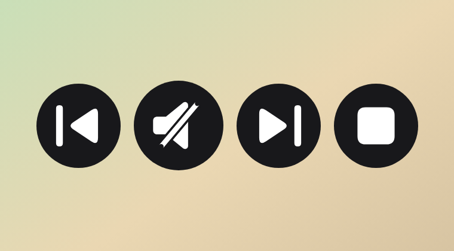

# Music-in-Power-BI

A Power BI visual with a transparent circle that plays songs from a column of audio URLs. The circle grows and shrinks with the visual’s width and height. Set the color, extra buttons, and auto play from the visual format pane.

The packaged visual is [dist/songPlayer.pbiviz](dist/songPlayer.pbiviz) (version 1.6.0.0). The same file is on the project page: [songPlayer.pbiviz](https://mortezakhosravi.github.io/Music-in-Power-BI/songPlayer.pbiviz).

Project page: [mortezakhosravi.github.io/Music-in-Power-BI](https://mortezakhosravi.github.io/Music-in-Power-BI/)

## Report view

The circle is the painted shape. A music note shows while a song is playing. A mute mark shows while it is stopped. Color comes from **Circle > Color**. **Circle > Design** chooses **Filled icon** or **Border line icon**. Both styles use iOS-style marks: a music note, a speaker with a slash, previous, next, and a rounded stop. **Playback > Previous, next, and stop** adds those circles. **Playback > Same size** makes every button the same size. **Playback > Auto play** starts the first song when the report loads.





These pictures are the packaged visual in report view: an SVG circle on the report canvas, with the visual background and border off. Power BI Desktop is not available in this environment, so the pictures were captured from the same JavaScript package Power BI loads.

## Use it in Power BI Desktop

1. Open a report.
2. In the Visualizations pane, select **Get more visuals** (`...`), then **Import a visual from a file**.
3. Choose `dist/songPlayer.pbiviz`.
4. Add **Song Player** to the page.
5. Drag the URL column into **Song URL**.
6. Open the visual’s format pane and set **Circle > Color**. That color is the circle. Under **Circle > Design**, choose **Filled icon** or **Border line icon**.
7. Under **Playback**, turn on **Previous, next, and stop**, **Same size**, or **Auto play** if you want them. They start off. With **Same size** off, the play circle stays larger than the other buttons.
8. Under **General > Effects**, turn **Background** and **Visual border** off so the report shows only the circles.
9. Resize the visual. The circle follows the shorter side. With the extra buttons on, the row or column fits the width and the height.
10. Click the circle to play. Click it again to pause. The mark is a music note while audio is playing and a mute mark while it is stopped.

Each row is a song, in order. When a song ends, the next row starts. After the last song, the button returns to play. Filtering the URL column changes which song the button plays.

Song values need to be direct `http` or `https` audio links, such as `.mp3`, `.wav`, `.ogg`, or `.m4a`. A link to a streaming page will not play. The first time a song loads, Power BI asks for web access. Choose **Allow**.

The music and mute marks take the readable contrast against **Circle > Color**: a light circle gets a dark mark, and a dark circle gets a white mark. Previous restarts the current song, or moves to the previous song when playback is already at the start. Next moves to the following song. Stop pauses and returns to the start of the current song. If a format or resize update arrives while a song is playing, playback keeps going.

## Example data

[docs/songs.csv](docs/songs.csv) has three direct MP3 links. In Power BI Desktop, choose **Get data > Text/CSV**, select that file, and load it. Drag **Song URL** into the visual’s **Song URL** field.

| Song | Song URL |
| --- | --- |
| Morning Drive | https://www.soundhelix.com/examples/mp3/SoundHelix-Song-1.mp3 |
| Night Circuit | https://www.soundhelix.com/examples/mp3/SoundHelix-Song-2.mp3 |
| Open Road | https://www.soundhelix.com/examples/mp3/SoundHelix-Song-3.mp3 |

These are SoundHelix example tracks. They are direct audio files, which is the shape the visual can play.

## Build

```bash
npm install
npm test
npm run package
```
